# MPicker Manual

Welcome to use MPicker. Here is the detail GUI instructions for membrane flatten and visualization.

## Load tomogram
  Click the `Open Raw` Button and choose a tomogram to process.
  Click the `Save Path` Button and choose a save folder. (A config file and a folder will be created for each tomogram under the save folder)
  OR
  Select a raw file by command `--raw ...`
  Select a save path by command `--out ...`
  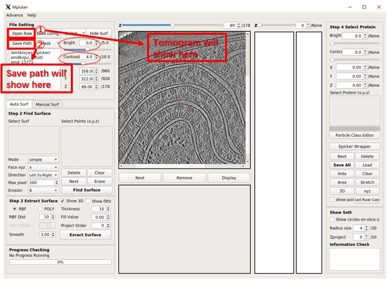
  You can adjust `Bright` and `Contrast`. In general Bright=0 and Contrast<=5 is good. 
  You can easily adjust any value in spinbox (bright, contrast, x, y, z ...) by rolling the wheel on it.
  
## Get Mask (membrane segmentation)
  - Press the `Mask` button on the upperleft of main GUI.
  - Choose `Open Mask` to load the mask **if you already have a membrane segmentation**.
  - Or Choose `Get Mask` to generate a segmentation by a pre-trained AI in a new GUI.
  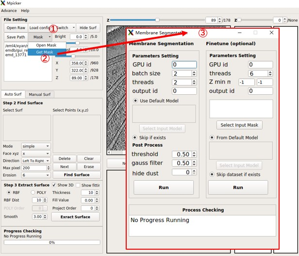
  
  ### Membrane Segmentation GUI:
  - Membrane Segmentation GUI has Parameters Setting and Post Process. (Ignore the right half)
    - Parameter Setting Part will generate segmentation with continued values (raw seg) by AI. The parameters only influence computation time.
    - Post Process Part will generate binary segmentation (only has value 0 or 1). It determines the final mask. (important)
    - Results will be saved in folder "memseg" under output folder for this tomogram.
  - Parameters Setting:
    - `GPU id`:  Which gpus to use (example: `0` use single gpu, `0,1` use 2 gpus).
    - `batch size`: Use 2 * number_of_gpus is a good try, it means each gpu process 2 batches at once.
    - `threads`: Same as batch size is good, less than it is ok.
    - `output id`: If the raw seg file with this id already exists, this part will be skipped (it is very slow compare to post process). Same model will generate same result, so there is no need to change it. Id can be any words.
  - Post Process:
    - `threshold`: Voxels in raw seg larger that it will be 1, smaller than it will be 0. 
    - `gauss filter`: Apply gaussian filter to raw seg with this sigma before threshold. 
    - `hide dust`: Delete small connect component in each 2d slice and then in 3d. The value will be pixel number cutoff in 2d and 100*value will be voxel number cutoff in 3d. 100 is a good try, use 0 to skip it.
  - Press `Run` button on the left side to start. After it finished, choose `Open Mask` in main GUI to load the result (example: `seg_post_id0_thres_0.50_gauss_0.50_voxel_0.mrc`).
  
## Step 2: Find Surface
  - There are two ways to Find Surface: One is `Auto Surf`(require Mask), the other is `Manual Surf`(doesn't require Mask, but need to mark many points by hand).
  
  ### **Auto Surf**
  - `Auto Surf` will automatically separate one surface from mask boundary. User need to select one or several points on **ONE** surface.
  1. Click on `Mask` and `Open Mask` to open the mask for the raw tomogram. Mpicker will generate the boundary when user input a mask
  2. Click on `Switch` to switch between raw tomo, mask tomo and boundary tomo. It's just for display, you can select the point in any mode, but only points near boundary are valid.
  3. Scroll and drag the mouse on the view to check the tomogram. 
    Locate the coord with the left press on the mouse.
  4. Right click menu and chose `save as reference` when the coord is right. OR Use Shortcut Key **`Shift+S`**.
    Then the coord will appear on the left.
  5. If the selected points is not satisfactory, you can delete the points by `Delete` Button OR 
    Right click near the selected point on the view and chose `Delete Reference` OR
    Use Shortcut Key **`Shift+D`** to delete the last select point
  6. Then change the parameters to get the better result 
  (You can use the default setting for the first time and adjust according to the results)
  1. Press `Find Surface` to find one surface from selected points.  You can add or delete points in the base of selected surface without changing its recorded points to generate new surface. So **remember to press** `Clear` before you start to select a new surface.
  
  - Here is all the Rightclick menu in view
    - `Save as Reference` **(Shortcut Key=`Shift+S`)**: Save the Selected points for surface finding. 
    - `Next Point` **(Shortcut Key=`Shift+X`)**: Select the next point (Same as `Next` Button above) 
    - `Delete Reference` **(Shortcut Key=`Shift+D`)**: Delete the points that are selected(Same as `Delete` above) 
    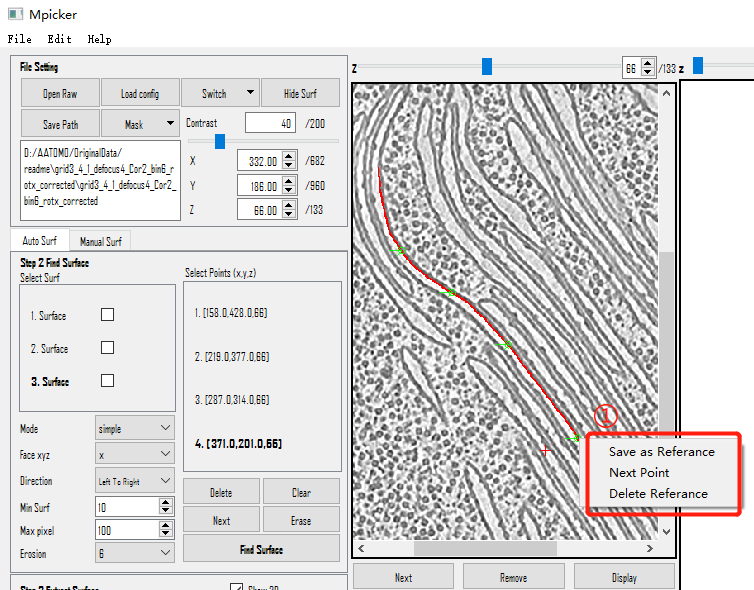
  - Here is all the parameters
    - `Mode`: In general, just use "simple" is good.
    - `Face xyz`: The orientation the surface face to.
    (There are 3 orientations: `x`,`y`,`z`, although there is rarely membrane perpendicular to z in general tomo)
    - `Direction`: How the surface will be extended on folk point, should be considered together with `Face xyz`
    - Consider a boundary with X shape (it will happen when seg is not good enough), different combination of `Face xyz` and `Direction` will separate different part of the X. Each point can have different xyz and direction.
    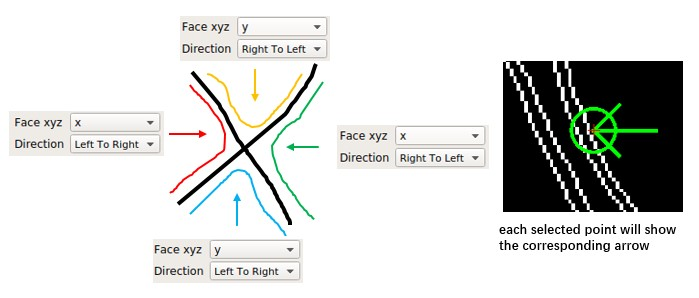
    - `Max pixel`: The largest length to extend from given points. Multi initial points with small max pixel will generate more robust result than one initial point with large max pixel.
    - `Erosion`: The way to generate boundary from mask, which greatly determines the result of surface finding. `6` is the default way. Ignore the strange name, hover the mouse on it in GUI for detail.
  - Here is all the Buttons below `Select Points` scrollArea
    - `Delete`: Delete the points that are selected(bold in `Select Points` scrollArea above)
    - `Clear`: Delete all the points
    - `Next`: Select the next point
    - `Erase`: Has no function for now.
    - `Find Surface`: Run the Surface Finding
    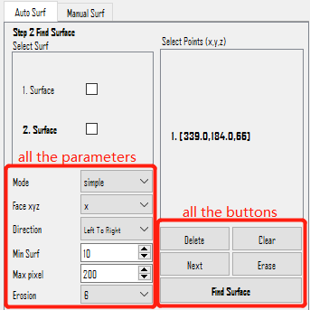
  - Here is all the Rightclick menu in `Select Surf` scrollArea
    - `Show No.Surface`: Show this selected result surface on the view.
    (It does NOT mean select surface. Select surface is by clicking on the No.Surface and make it Bold. 
    `Show No.Surface` can help user can get to know which surface finding is done)
    - `Delete No.Surface`: Delete this selected result surface permanently.
    - `Show Selected`: Show ALL THE SELECTED result surfaces. It will show all the surface whose ②Checkbox is checked.
    - `Show All`: Show ALL the result surfaces. It will also check all the ②Checkbox.
    - `Hide All`: Close ALL the result surfaces that are showed. It will also close all the check in the ②Checkbox
    - `Delete Selected`: Delete ALL THE SELECTED result surfaces. It will show all the surface whose ②Checkbox is checked.
    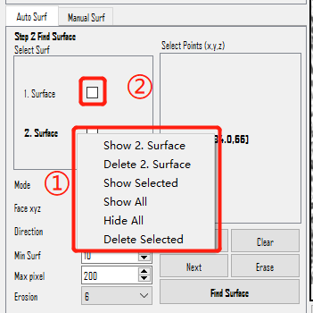
  
   
  
  ### Manual Surf
  - `Manual Surf` means manually surf finding. User need to select several points on **ONE** surface. 
  - There is no parameters in the section, but requires lot of manual select points. For example, if you select 5 points in one slice and select points for 5 slices, it is 25 points in total.
  - User need to use points to indicate the surface so manual surface finding need to get select points as many as possible
    (Points in different slice on the same surface in tomogram). 
  1. Switch to Manual Surf mode by clicking on the `Manual Surf`
  2. Right click and chose `save as reference` when the coord is right. OR Use Shortcut Key **`Shift+S`**.
    Then the coord will appear on the left.
  3. If the selected points is not satisfactory, you can delete the points by `Delete` Button OR Right click near the selected point on the view and chose `Delete Reference` OR Use Shortcut Key **`Shift+D`** to delete the last select point
  4. Press `Save New` to save the selected points as a new surface. You can add or delete points in the base of selected surface without changing its recorded points to generate new surface. So **remember to press** `Clear` before you start to select a new surface.
  5. You can also load a txt file by press `Load` if you already got coords elsewhere.

  - Here is all the Rightclick menu in view
    - `Save as Reference` **(Shortcut Key=`Shift+S`)**: Save the Selected points to indicate the surface. 
    - `Next Point` **(Shortcut Key=`Shift+X`)**: Select the next point (Same as `Next` Button above) 
    - `Delete Reference` **(Shortcut Key=`Shift+D`)**: Delete the points that are selected(Same as `Delete` above) 
    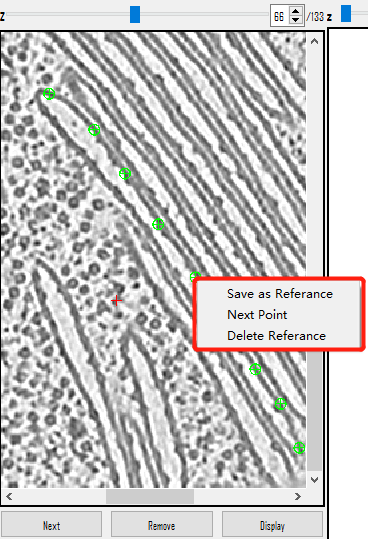
  - Here is all the Rightclick menu in `Select Surf` scrollArea(Same as `Select Surf` in `Auto Surf`)  
    - `Show No.Surface`: Show this selected result surface on the view.
    (It does NOT mean select surface. Select surface is by clicking on the No.Surface and make it Bold. 
    `Show No.Surface` can help user can get to know which surface finding is done)
    - `Delete No.Surface`: Delete this selected result surface permanently.
    - `Show Selected`: Show ALL THE SELECTED result surfaces. It will show all the surface whose ②Checkbox is checked.
    - `Show All`: Show ALL the result surfaces. It will also check all the ②Checkbox.
    - `Hide All`: Close ALL the result surfaces that are showed. It will also close all the check in the ②Checkbox
    - `Delete Selected`: Delete ALL THE SELECTED result surfaces. It will show all the surface whose ②Checkbox is checked.
    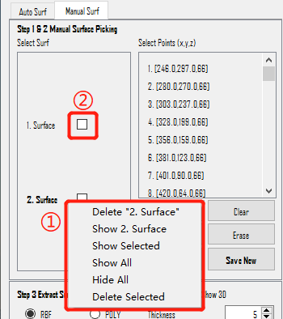
    

## Step 3: Extract Surface
  - There are two method that can be use for Surface Extraction. 
    One is Polynomial surface **fitting** (short for `POLY`). 
    The other one is Radial Basis Function surface **interpolation** (short for `RBF`)
  1. Click one surface in step2
  2. Choose the `RBF` or `POLY` Mode, then adjust other parameters （`Show 3D` and `Show fitting` will not influence the result）
  3. Press `Extract Surface` to get the result in Buffer scrollArea.
  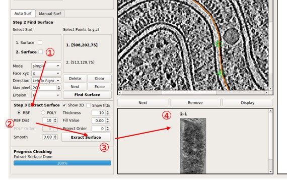
  
  ### Parameters introduction
  - `Extract Surface` Flatten **ONE** surface based on RBF or POLY
  - Here is all the parameters
    - `RBF`: The Radio Button is checked means Choose `RBF` Mode. In general it flatten the membrane better, but the surface may be not smooth.
    - `POLY`: The Radio Button is checked means Choose `POLY` Mode. The result is smooth enough (polynomial function), but hard to flatten membranes perfectly.
    - `RBF Dist`: Only used in `RBF` mode. Distance between sampling points on surface, in pixel. Smaller dist will use more points and be slower. 10 is small enough in general. For Manual Surf, you can set it to 1 to use nearly all points. 
    - `Smooth`: Only used in `RBF` mode. Decide the error allowed in the interpolation. Too small `Smooth` or too small `RBF Dist` will cause remarkable distortions of slices far from center layer (caused by unsmoothness of the surface). We use 3 in general.
    - `POLY Order`: Only used in `POLY` mode. Order of polynomial when do the surface fitting. High order may flatten the surface better but will produce awful boundary. Less that 10 in general.
    - `Thickness`: Number of slices above and under the center layer. So the final thick (in pixel) of flatten tomo will be 2*`Thickness`+1.
    - `Fill Value`: Fill the value to the pixel in flatten tomo where there is no corresponding pixel in original tomo. 0 is a special value here, which means fill by mean value (not 0). 
    - `Project Order`: Order of polynomial when do the cylinder fitting. Surface wil be projected on cylinder to reduce the distortion of flatten. 4 is a good try for opened cylinder, -1 is for closed cylinder, set to 0 or 1 if you think your surface is not cylinder at all.
    - `Show3D`: Whether or not to show some intermediate results. It will show the input surface (from step2) in 3d, and the result of denoise, and which points are selected for RBF interpolation. It is helpful if you want to adjust parameters. It need Open3D, and may fail for remote connection (such as ssh -X).
    - `Show fitting`: Whether or not to show the result of surface fitting, as well as cylinder and plane.
    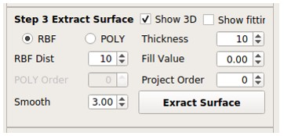

  ### Scroll Area
  - User can process and choose the result tomogram from Surface Extract.
    - `Next`: Move on the the next result tomogram.
    - `Remove`: Delete the result tomogram permanently.
    - `Display`: Check the result tomogram on the right side.
    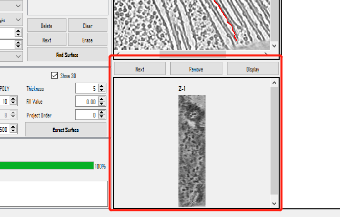
  
## Step 4: Select Proteins
  
  ### Check the Result
  - Left click to locate the coord
  - Right click to add the select points, delete the select points and check out the next select points
  - Double click to select a point
  - We save and load coords by xyz start from 1
  - Do not forget to press **`Save all`** to save the particles you pick to txt file
  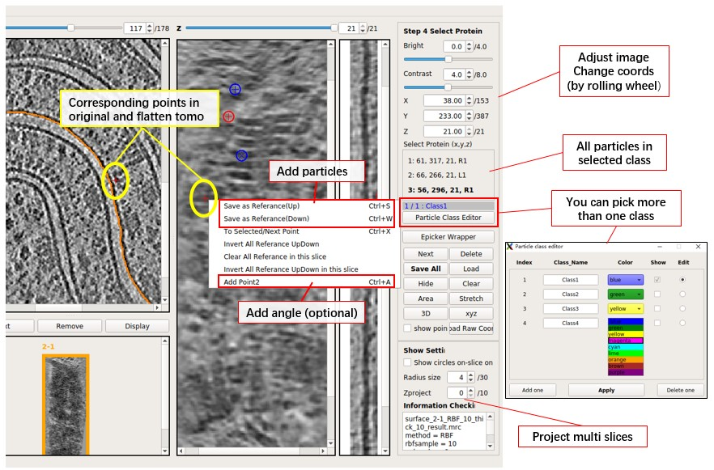
  
  ### Parameter introduction & Keyboard shortcut
  - Here is Parameter introduction:
    - `Select Protein(x,y,z)`: The scrollArea to store all the selected protein coordinates. L R means up or down, 1 2 means wether it contains angle information (you need 2 points to get an angle).
    - `Next`: Check out the next selected proteins
    - `Delete`: Delete the selected proteins
    - `Save All`: Save all proteins into the file. **Press it before switch to other flatten tomo, will NOT save automatically.**
    - `Load`: Load coords of protein. A file with 3 columns, each row is the x y z of one particle. xyz start from 1, not 0. If more than 3 columns, will ignore rest of columns. 
    - `Load Raw Coord`: Similar as `Load`, but use coords in original tomo. It will convert input coords to the coords in flatten tomo, and ignores coords out of flatten tomo.
    - `Hide`: Hide all the selected proteins on the view.(Help user to check out proteins)
    - `Clear`: Clear all coords in the current class. Will not save to the file unless you press `Save all`.
    - `3D`: Check out 3D mode of the current result tomogram.
    - `xyz`: Check out xyz mode of the current result tomogram.
    - `Radius size`: Change the circle of the selected protein to help user have better understanding of selected proteins. Circle will be shown in multi slices like a sphere (not sphere in fact), unless you check `Show circles on-slice only`.
    - `Area` and `Stretch`: Show area deformation and angle deformation in color.
    - `Epicker Wrapper` is a wrapper of Epicker, you need to install Epicker at first to use it. It is a deep learning software for particle picking, but there is no pre-trained model. You need to generate some trainset and train a model at first. You can try to label 100 particles for training at first.
  - Here is main keyboard shortcut
    - `Save as Reference Up` **(Key=`S`)**: Pick the particle, if Z of protein extracellular domain is bigger than membrane (protein in upper half part).
    - `Save as Reference Down` **(Key=`W`)**: Pick the particle, if Z of protein extracellular domain is smaller than membrane (protein in lower half part). 
      We distinguish Up or Down just in case you want to use normal vector of membrane for the calculation of subtomo average. You can ignore the difference of Up and Down if you just need coordinates.
    - `Next Point` **(Key=`X`)**: Check out the next select proteins(Same as `Next`)
    - `Delete Reference` **(Key=`CTRL+D`)**:Delete the select points(Same as `Delete`)
    - `Add Point2` **(Key=`CTRL+A`)**: Add orientation information for the selected particle by add another point. The second point will connect the selected particle and form a line to label the orientation. The length of line doesn't effect the result.
    - `Delete Point2` **(Key=`CTRL+Z`)**: Delete the Point2 for the selected particle, and the line will disappear.
    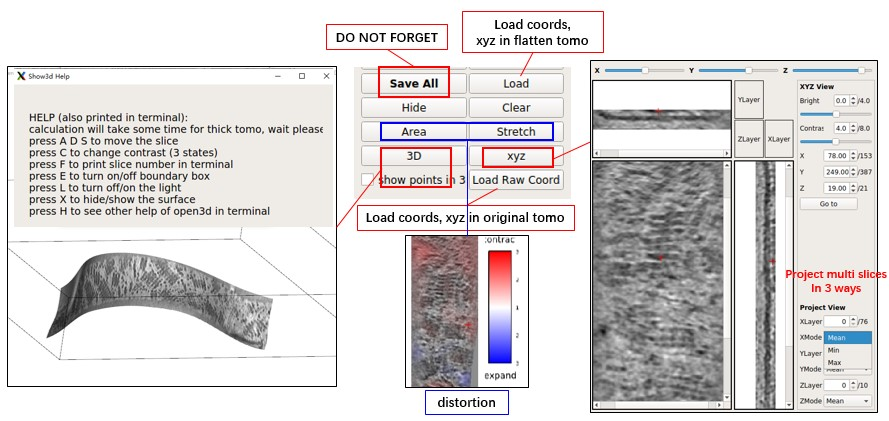
    
  ### Output file
  - Each surface in **step2** has a separate folder, and each surface can generate more than one flatten tomo.
  - Each flatten tomo has a txt file end with `_SelectPoints.txt`, it save the result of particle picking.
  - The mrc file of flatten tomo is end with `_result.mrc`.
  - The npy file end with `_convert_coord.npy` saves the conversion from flatten coords to original coords. It is a 4d array, `z_raw, y_raw, x_raw = array[:, z-1, y-1, x-1] + 1`
  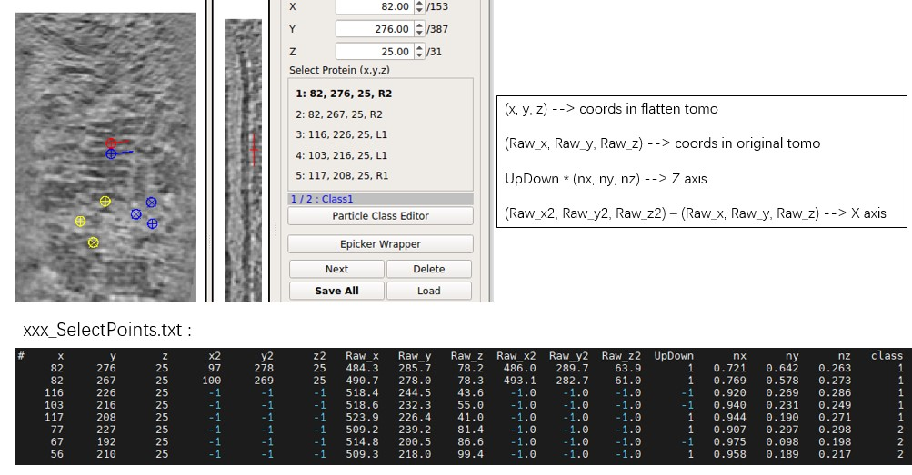

  # File description:

  taking tomogram named **grid3_4_1_corrected.mrc** for example

  ## Example grid3_4_1_corrected.mrc

```
--<results_dir>
  -- grid3_4_1_corrected                                  (Store all the result and process history)
      -- my_boundary6.mrc                                 (Edge detection of the raw tomogram) 
      -- manual_1_grid3_4_1_corrected 
         -- manual_1.config                               (Config file for manual surface finding)
         -- manual_1_surf.txt                             (Selected points)
         -- manual_1-1.config                             (Config file for manual surface extraction)
         -- manual_1-1_RBF_10_thick_5_result.mrc          (result tomogram)
         -- manual_1-1_RBF_10_thick_5_convert_coord.npy   (Coord conversion numpy)
         -- manual_1-1_RBF_10_thick_5_SelectPoints.txt    (Select protein coord)
         -- ...
      -- manual_2_grid3_4_1_corrected
      -- ...
      -- surface_1_grid3_4_1_corrected
         -- surface_1.config                              (Config file for auto surface finding)
         -- surface_1_surf.mrc.npz                        (Surface finding result tomogram)
         -- surface_1-1.config                            (Config file for auto surface extraction)
         -- surface_1-1_RBF_10_thick_5_result.mrc         (result tomogram)
         -- surface_1-1_RBF_10_thick_5_convert_coord.npy  (Coord conversion numpy)
         -- surface_1-1_RBF_10_thick_5_SelectPoints.txt   (Select protein coord)
      -- surface_2_grid3_4_1_corrected
      -- ...
  -- memseg                                               (Store all the mask result)
      -- seg_raw_id0.mrc                                  (raw seg result, **DO NOT USE IT AS MASK**)
      -- seg_post_id0_thres_0.50_gauss_0.50_voxel_100.mrc (processed mask, This is the INPUT MASK)
      -- ...
  -- grid3_4_1_corrected.config                           (You can reload all the history by Load config file in GUI)
```

  # Additional Information

  ## Additional File
  - py files start with `Mpicker_` are all executable scripts. Here we show some of them. You can see more details of scripts by `--help`.
    - `Mpicker_particles.py`: can merge all _SelectPoints.txt of all flatten tomo in an raw tomo, can also convert them to Euler angle.
    - `Mpicker_2dprojection.py`: can project particles along norm vector from raw tomo to get 2d images, can also get corresponding 2dctf from given 3dctf. (for 2Dclass)
    - `Mpicker_convert_coord.py`: can convert coords between raw tomo and flatten tomo.
    - `Mpicker_mrcnpy2mrc.py`: can generate flatten tomo from a given flatten tomo and a new raw tomo. (for example, you already got a flatten tomo from an isonet-treated raw tomo, you can get a flatten tomo from an untreated tomo directly)
    - `Mpicker_convert_mrc.py`: can convert .mrc.npz file to .mrc, so that you can edit it and replace the old one. (we store the surface as .npz just to save space)
  - imagev2.ui, check.ui, memseg.ui, show3d_help.ui is for GUI design. User can open and edit it by PyQt-Designer