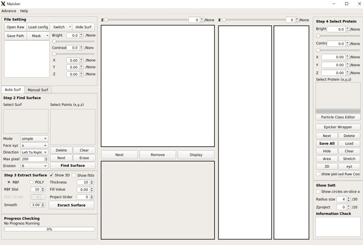

# MPicker
Welcome to use MPicker. It's a tool for membrane flatten and visualization.

See our website [thuem.net](http://thuem.net) for details.

## Environment Setup
  - ### if no Conda
    - We recommend using Conda, because our offline environment package is very large and Conda is very commonly used in python. You can install conda from [https://docs.conda.io/projects/miniconda/en/latest/](https://docs.conda.io/projects/miniconda/en/latest/)
    - We generate the environment packages by conda-pack on CentOS7. It should work for other Linux system. You have to use conda if your system is not Linux.
    - Download `environment.tar.gz` and `code.tar.gz`
    - Uncompress them into 2 **different** empty folders. Here we call them `/absolute/path_to/save_code` and `/absolute/path_to/save_env`, replace them to real path you want to install mpicker at.
      ```
      mkdir /absolute/path_to/save_code
      tar -zxvf code.tar.gz -C /absolute/path_to/save_code
      mkdir /absolute/path_to/save_env
      tar -zxvf environment.tar.gz -C /absolute/path_to/save_env
      ```
    - Unpack the conda environment (just need once)
      ```
      source path_to/save_env/bin/activate
      conda-unpack
      source path_to/save_env/bin/deactivate
      ```
    - After unpack, you can activate the environment by
      ```
      source path_to/save_env/bin/activate
      ```
      and close the environment by
      ```
      source path_to/save_env/bin/deactivate
      ```

  - ### Conda
    - Download `code.tar.gz` ( `environment.tar.gz` is not needed)
    - Uncompress it into an empty folder. Here we call it `/absolute/path_to/save_code`, replace it to real path you want to install mpicker at.
      ```
      mkdir /absolute/path_to/save_code
      tar -zxvf code.tar.gz -C /absolute/path_to/save_code
      ```
    - You can edit the file `env.yml` in folder path_to/save_code/mpicker_gui as you like
      - you can change "mpicker_full" to the environment name you like
      - you can change "cudatoolkit=10.1" to other version if your gpu driver doesn't support it (=11.0 or =9.2 for example)
    - Then you can create the conda environment from this file (may take 10min+)
      ```
      conda env create -f env.yml
      ```
    - Finally, you can activate the environment by
      ```
      conda activate mpicker_full
      ```

  ### Environment Setup without membrane segmentation
  - No auto membrane segmentation by AI, but smaller installation size
  - You can replace `code.tar.gz` by `code_noseg.tar.gz` , which without folder memseg_v3
  - Just replace `environment.tar.gz` by `environment_noseg.tar.gz` (if no Conda)
  - Just replace the file `env.yml` by `env_simple.yml` (Conda)


## Get Start
  
- ### Simple Start

  - Activate the environment at first, and you can see the result of
    ```
    which python
    ```
    should be something like
    ```
    path_to/save_env/bin/python # if no conda
    path_to/miniconda/envs/mpicker_full/bin/python # conda
    ```
  - Run this command to open Mpicker
    ```
    python path_to/save_code/mpicker_gui/Mpicker_gui.py
    ```
    You can add path_to/save_code/mpicker_gui into your PATH and just open Mpicker by
    ```
    Mpicker_gui.py
    ```
- ### Troubleshooting
  - For Linux, if your shell is not bash, for example csh, switching to bash may solve the problem about environment setup. You can check you shell by
    ```
    echo $0
    ```
  - If you fail to execute .py file directly you can try to run bin/mpicker.sh, which is a bash wrapper
  - You can add path_to/save_code/bin into PATH and activate the environment, then you can run Mpicker by
    ```
    mpicker.sh
    ```
  - You can replace `PYTHON="$(which python)"` in bin/mpicker.sh to `PYTHON=/absolute/path_of/python` , if your system just fail to find the right python we installed. By this, you can run Mpicker by mpicker.sh without activate environment at first

- ### Command Start

  - Mpicker support these parameters input from command line

    `--raw Path to raw tomogram map` 

    `--mask path to mask tomogram map` 

    `--out Path to save all the result files`
    
    `--config Path to config file (config file for reloading all the process history)`

  - Example: (Open a new GUI)
    
    ```
    Mpicker_gui.py --raw grid3_4_1_corrected.mrc \
    --mask segmentation_grid3_4_1_corrected.mrc \
    --out ../result
    ```
  - Example: (Reload a existing GUI)
    
    ```
    Mpicker_gui.py --config ../grid3_4_1_corrected.config
    ```
  - Then you will get the following GUI:
  
## 	Membrane Visualization
  - For More Detailed instructions, Please see the **Tutorial.md** and **Manual.md**

